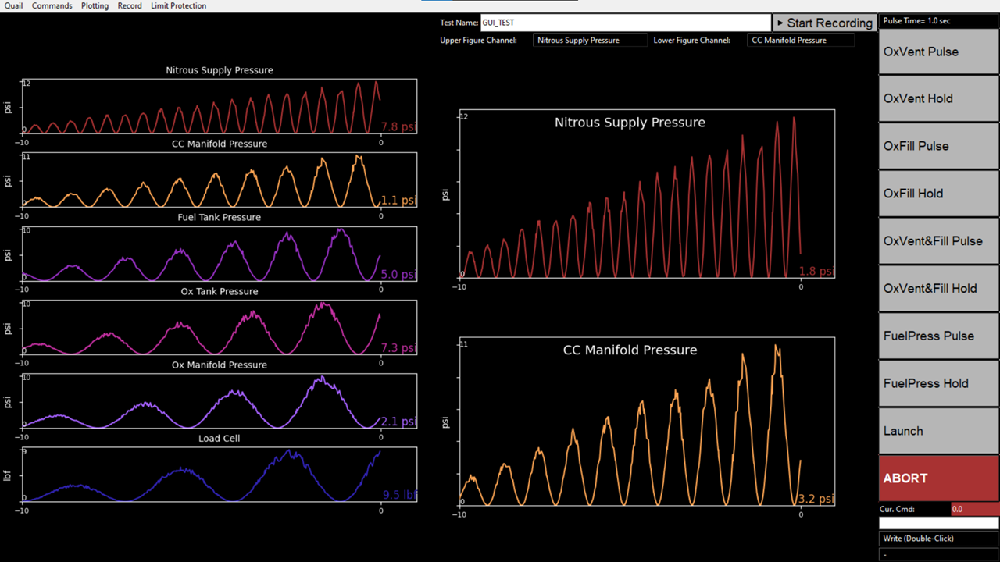
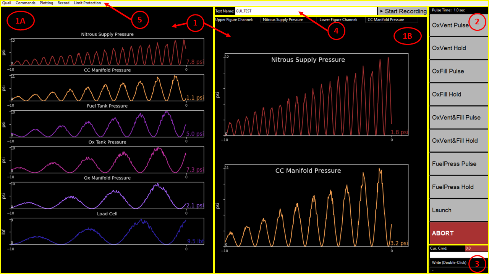

Quail Dashboard v1.1
====================

** Last Updated: 1/13/2021 **  

Overview
--------
The Quail Dashboard is a Python Tkinter application that reads data from serial USB communication and displays it in real time.
Additionally, the dashboard provides users the option to define complex commands without knowing the Quail numeric codes.
The program starts two independent processes: a "greedy" serial collector (called the **data process**) and the user-interface applciation (called the **GUI**).
The two interact via process-safe queues, ensuring that all serial messages are collected even if the GUI locks up or otherwise delays program execution (note
that threading is not equivalent to multiple processes- the Python GIL prevents threads from executing simultaneously, so the 'multiprocessin' library is used instead).

The application has currently been verified on Windows 10 and Linux (via WSL2 & Ubuntu).

Getting Started
---------------
All required modules and minimum versions are listed in 'requirements.txt' - to ensure that you have all required modules, run 'python -m pip install -r requirements.txt' in your terminal.

To run the application, double-click 'QuailDashboard_v1,1.py' in File Explorer or run 'python QuailDashboard_v1,1.py' in your preferred terminal.

GUI Layout
----------

The dashboard consists of a MainWindow instance, an inheritor of the Tk.tk() "root" application. This primary container is broken down into several sub-components, as seen
in the image below:

1. **GraphPanes** - this object owns _1A_ and _1B_, the two panes that have live graphs of sensor data. 
The GraphPanes object owns and handles the data to be plotted, as well as the identifying features of the plots (channel name, units, colors, etc.). Users can adjust the channel name, the units of the data sent via Quail, and the units of the data displayed on screen (allowing conversions) during runtime.  
	A) **ChannelPane** - this child of the GraphPanes object plots all data received from Quail.  
	B) **FocusPane** - this child of the GraphPanes object plots two of the channels larger for easier viewing (the user can select which channels are displayed using the dropdowns at the top). 
2. **ButtonPane** - this pane holds a set of buttons that send user-defined command sequences to Quail. Which commands are available on the buttons can be adjusted during runtime (with the exception of Abort, which is always present).
3. **ManualCmdPane** - this pane allows the user to interface directly with Quail by sending numeric commands. Additionally, users can input "equations" consisting of numeric commands joined by + and/or "wait" commands followed by the time delay between the commands in seconds
 (e.g., ' 10 + wait2 + 20 ' sends the command '10', then waits 2 seconds, then sends '20'). Users can also select aliased command equations from the dropdown (and add more aliases during runtime).
4. **RecordPane** - this pane allows the user to start and stop local recording of the data recieved from Quail. Raw data is written to a '.csv' file that is time-and-date stamped. Users can also specify a test name in the text entry box prior to starting the recording.
5. **MenuBar** - the menu bar allows the adjustment of various on-screen options. Users can adjust the channel names/units, re-scale or tare plots, choose which commands are displayed in the ButtonPane, and more.

Credit
------
Developed by Max Newport ('newpomax@stanford.edu' or 'newpomax@gmail.com') for Stanford Student Space Initiative's Rockets Team. 

